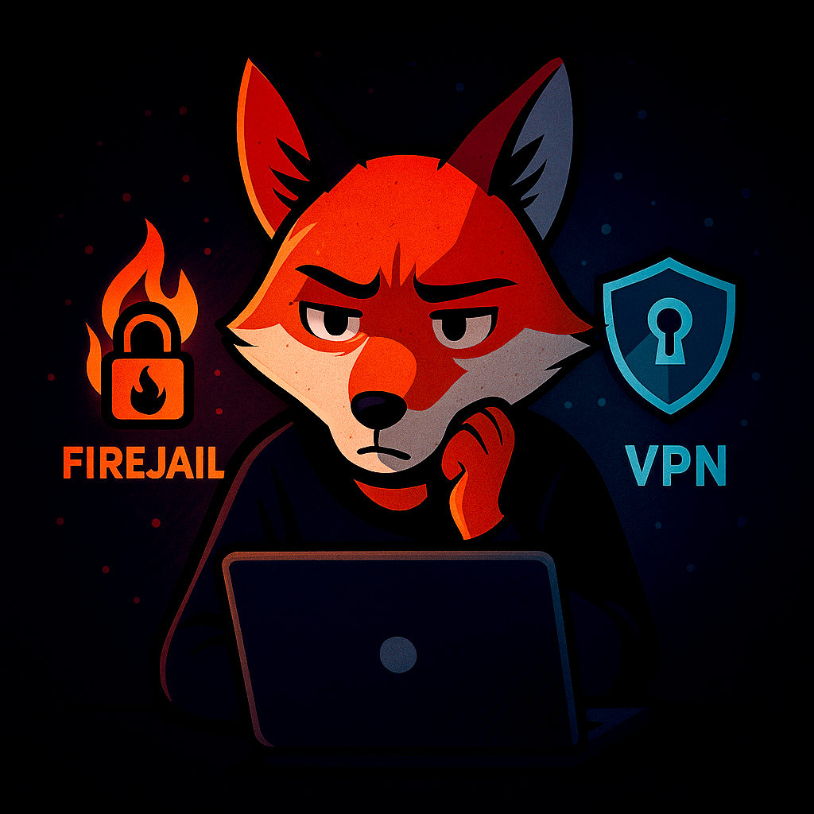
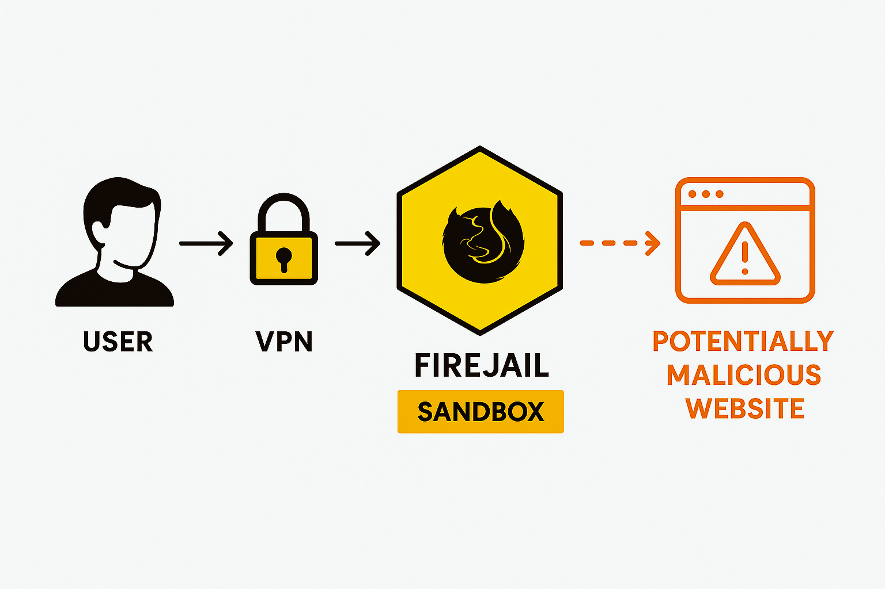

<h1 align="center">SafeFox VPN Firejail</h1>

<i>© 2025 Virginie Lechene — Tous droits réservés</i> 
<i>Reproduction interdite sans autorisation. Usage pédagogique uniquement.</i>

---

# SafeFox VPN Firejail

Navigateur sécurisé basé Firejail et un VPN, conçu pour les tests d'intrusion, l’analyse web et la cybersécurité.

---

## Sommaire

- [Avertissement](#avertissement)
- [Objectif](#objectif)
- [Fonctionnement global](#fonctionnement-global)
- [Configuration mise en place](#configuration-mise-en-place)
- [Prérequis](#prérequis)
- [Commandes à exécuter](#commandes-à-exécuter)
- [VPN : ce qu’il faut comprendre](#vpn--ce-quil-faut-comprendre)
- [À savoir](#à-savoir)
- [Licence](#licence)

---

## Avertissement

**Usage strictement pédagogique.**
L’auteure décline toute responsabilité en cas d’utilisation malveillante ou illégale.

---

## Objectif

Fournir une méthode simple pour lancer un navigateur **sécurisé et isolé**, dans le cadre :
- de tests de sécurité (pentests),
- d’analyses web ou réseau,
- de formations à la cybersécurité.

<em>Figure : Schéma de fonctionnement de Safefox (VPN → Firejail → Web)</em>

---

## Fonctionnement global

- **VPN** : chiffre le trafic et masque l’adresse IP réelle.
- **Firejail** : bac de sable (sandbox) Linux restreignant l’environnement de Firefox.
- **Option `--private`** : empêche tout accès aux fichiers personnels.
- **Alias `safefox`** : permet un lancement rapide depuis terminal.

---

## Configuration mise en place

| Élément | Statut attendu |
|---------------------------------|----------------|
| VPN actif | ✅ |
| Firejail installé | ✅ |
| Firefox installé | ✅ |
| Alias `safefox` fonctionnel | ✅ |
| Exécution en utilisateur normal| ✅ |

---

## Prérequis

- **Système** : Kali Linux, Debian ou Ubuntu
- **Logiciels nécessaires** :
- `firejail`
- `firefox-esr`
- Un **client VPN actif** (ex : NordVPN, ProtonVPN)
- Les **droits sudo** sont requis pour l'installation

---

## Commandes à exécuter

### 1. Télécharger le script

En tant qu’utilisateur (non-root) :

curl -L https://raw.githubusercontent.com/virg736/safefox-vpn-firejail/main/Script-safefox-vpn-firejail -o install-safefox.sh

2. Rendre le script exécutable
chmod +x install-safefox.sh

3. Lancer le script
./install-safefox.sh

💡 Le script installe Firejail, Firefox-Esr et configure l’alias safefox.

Vérification après installation

Une fois l’installation terminée, ouvrez un nouveau terminal ou rechargez le fichier de configuration pour activer l'alias safefox :

source ~/.zshrc

ou
source ~/.bashrc

Ensuite, lancez :
safefox

---

 ## VPN : ce qu’il faut comprendre

Ce script ne configure pas de VPN. Il part du principe que vous disposez déjà un VPN fonctionnel.

Deux scénarios possibles :

1. VPN installé sur l’ordinateur hôte :
- La machine virtuelle (ex. Kali VirtualBox) accède à  Internet via NAT.
- Dans ce cas, le  VPN de l’hôte protège également la VM.

2. VPN installé directement dans la VM :
L’utilisateur lance le VPN depuis Kali.

Commande de exemple :

nordvpn connecte

Dans tous les cas, le VPN doit être activé avant d’utiliser safefox.

Le script vérifie que vous n’êtes pas en tant que root

Il détecte automatiquement le fichier de configuration .bashrc ou .zshrc

Il ajoute l’alias safefox='firejail --private firefox'

Firefox est lancé sans cookies ni historique (mode isolé)

Pour garantir une navigations sécuritée, il est recommandé d’utiliser un VPN fiable.

---

# À savoir

## 🔍 Pourquoi cette méthode est utilisée ?

Cette méthode est utilisée par les **professionnels de la cybersécurité** et les **hackers éthiques** dans un objectif précis :

 **Comprendre les techniques d’attaque pour mieux s’en défendre.**

Elle permet de :

- Analyser des sites piégés ou malveillants sans exposer son système
- Étudier le comportement d’un site suspect (scripts, redirections, trackers…)
- Reproduire des scénarios d’attaque dans un environnement isolé
- Se former, expérimenter ou sensibiliser sans prise de risque

Elle combine deux outils puissants :

- 🔒 **Firejail** : isole complètement le navigateur (aucun accès aux fichiers ni à l’environnement utilisateur)
- 🛡️ **VPN** : chiffre le trafic et masque l’identité réseau

C’est une approche préventive, utilisée dans les audits, la recherche en sécurité, les formations et les environnements d’apprentissage.

🔧 Il existe aussi d'autres outils qui répondent aux mêmes besoins, comme :
**AppArmor**, **SELinux**, **Docker**, ou encore les **machines virtuelles**, souvent utilisés selon les cas d’usage.

> ⚠️ **Ce projet est à but éducatif uniquement.**
> Toute utilisation doit rester dans un cadre légal et responsable.

---

 ## Licence

Le script est publié sous la licence **MIT**.

---

## À propos de l’usage

Ce projet est destiné **exclusivement à des fins pédagogiques**, notamment dans le cadre :
- d’une formation en cybersécurité,
- de tests d’intrusion légaux (pentest),
- d’analyses réseau dans un environnement contrôlé.

> L’auteure **ne cautionne ni n’autorise** l’utilisation de ce script en dehors d’un cadre légal strictement défini.
> Toute utilisation non conforme est interdite et relève **uniquement de la responsabilité de l’utilisateur**.

---

## Droits sur les visuels

Les visuels, illustrations ou captures présents dans ce dépôt sont la propriété exclusive de l’auteure.
Toute reproduction ou réutilisation sans **autorisation préalable** est interdite.

© 2025 Virginie Lechene — Tous droits réservés.

  

