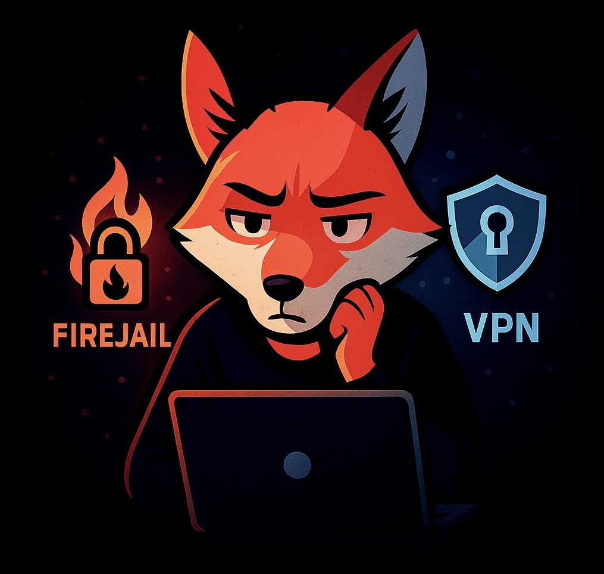
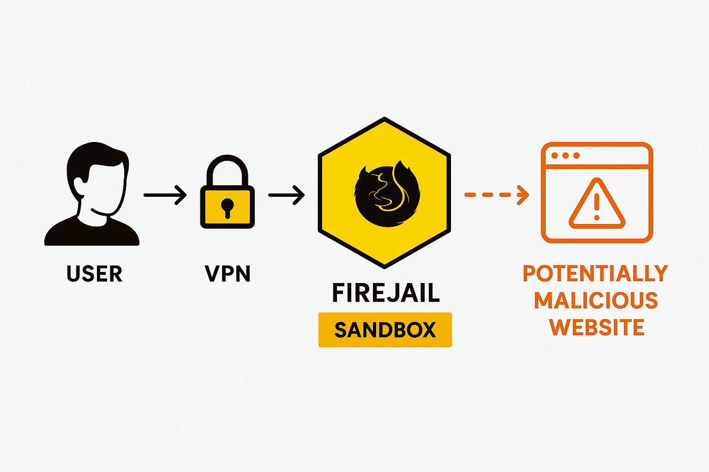

<h1 align="center">SafeFox VPN Firejail</h1>

<strong>© 2026 Virginie Lechene.</em>

---

# SafeFox VPN Firejail

Navigateur isolé basé sur **Firejail** et associé à un **VPN**, conçu pour les tests de sécurité autorisés, l'analyse web et l'apprentissage de la cybersécurité.

---

## Sommaire

- [Avertissement](#avertissement)
- [Objectif](#objectif)
- [Fonctionnement global](#fonctionnement-global)
- [Configuration mise en place](#configuration-mise-en-place)
- [Prérequis](#prérequis)
- [Commandes à exécuter](#commandes-à-exécuter)
- [VPN : ce qu'il faut comprendre](#vpn--ce-quil-faut-comprendre)
- [À savoir](#à-savoir)
- [Licence](#licence)

---

## Avertissement

⚠️ **Ce projet a été conçu principalement dans un objectif pédagogique et défensif.**

Toute utilisation doit respecter la législation applicable, les autorisations nécessaires ainsi que les règles des systèmes et réseaux concernés.

Ce projet ne constitue pas une autorisation d'accéder à des systèmes, réseaux, comptes ou données appartenant à des tiers.

---

## Objectif

Fournir une méthode simple pour lancer un navigateur dans un environnement isolé, notamment dans le cadre :

- de tests de sécurité réalisés avec les autorisations nécessaires ;
- d'analyses web ou réseau ;
- de formations à la cybersécurité.

<em>Figure  : Schéma conceptuel des couches de protection de SafeFox (VPN + Firejail + navigateur)</em>

---

## Fonctionnement global

- **VPN :** chiffre le trafic entre l'appareil et le serveur VPN et masque l'adresse IP publique de l'utilisateur aux services consultés.

- **Firejail :** bac à sable (*sandbox*) Linux permettant de confiner Firefox et de limiter son accès aux ressources du système.

- **Option `--private` :** lance le navigateur avec un répertoire personnel temporaire et isolé. Les données créées dans cet environnement ne persistent pas après la fermeture du bac à sable.

- **Alias `safefox` :** permet un lancement rapide depuis le terminal.

---

## Configuration mise en place

| Élément | Statut attendu |
|---|---|
| VPN actif | ✅ |
| Firejail installé | ✅ |
| Firefox ESR installé | ✅ |
| Alias `safefox` fonctionnel | ✅ |
| Exécution en utilisateur normal | ✅ |

---

## Prérequis

- **Système :** Kali Linux ou Debian
- **Logiciels nécessaires :**
  - `firejail`
  - `firefox-esr`
  - un client VPN fonctionnel (ex. : NordVPN, Proton VPN)
- Les droits `sudo` sont requis pour l'installation des dépendances.
- SafeFox doit ensuite être exécuté avec un compte utilisateur normal, et non en tant que `root`.

---

## Commandes à exécuter

### 1. Télécharger le script

En tant qu'utilisateur **non-root** :

## Commandes à exécuter

### 1. Cloner le dépôt

git clone https://github.com/virg736/safefox-vpn-firejail.git
cd safefox-vpn-firejail

2. Rendre le script exécutable
chmod +x install-safefox.sh

3. Lancer le script
./install-safefox.sh

💡 Le script installe Firejail et Firefox ESR, puis configure l’alias safefox.

Vérification après installation

Une fois l’installation terminée, ouvrez un nouveau terminal ou rechargez le fichier de configuration de votre shell :

source ~/.zshrc   
ou   
source ~/.bashrc   

Ensuite, lancez :   
safefox   

---

 ## VPN : ce qu’il faut comprendre

SafeFox ne configure pas et n’installe pas de VPN.

Le projet part du principe que vous disposez déjà d’un VPN fonctionnel si vous souhaitez en utiliser un avec SafeFox.

### Deux scénarios sont possibles

#### 1. VPN installé sur l’ordinateur hôte

Si Kali Linux ou Debian est exécuté dans une machine virtuelle configurée en mode NAT, le trafic de la machine virtuelle passe généralement par la connexion réseau de l’hôte.

Selon le logiciel VPN utilisé et sa configuration, le trafic de la machine virtuelle peut également être acheminé par le VPN de l’hôte.

> ⚠️ Il est recommandé de vérifier l’adresse IP publique depuis la machine virtuelle avant d’utiliser SafeFox.

#### 2. VPN installé directement dans la machine virtuelle

Le VPN peut également être installé et lancé directement depuis Kali Linux ou Debian.

Exemple avec un client VPN compatible :

nordvpn connect

---

## 🔍 Pourquoi cette méthode est-elle utilisée ?

Cette approche peut être utilisée par des professionnels de la cybersécurité, des chercheurs en sécurité et des spécialistes des tests d’intrusion autorisés afin de mieux comprendre certaines techniques d’attaque et d’améliorer les mesures de protection.

Elle permet notamment de :

- analyser des sites suspects dans un environnement isolé ;
- étudier le comportement d’un site (scripts, redirections, trackers, etc.) ;
- reproduire des scénarios de test dans un environnement contrôlé et autorisé ;
- se former, expérimenter ou sensibiliser en limitant les risques.

Elle repose sur deux mécanismes complémentaires :

- 🔒 **Firejail** : restreint l’environnement du navigateur et limite son accès aux ressources du système ;
- 🛡️ **VPN** : chiffre le trafic entre l’appareil et le serveur VPN et masque l’adresse IP publique de l’utilisateur auprès des services consultés.

Cette approche peut être utile pour la formation, les audits autorisés, la recherche en sécurité et les environnements d’apprentissage.

🔧 D’autres mécanismes d’isolation peuvent également être utilisés selon les besoins, notamment AppArmor, SELinux, les conteneurs ou les machines virtuelles.

> ⚠️ Ce projet est destiné à un usage pédagogique et défensif. Toute utilisation doit rester dans un cadre légal, autorisé et responsable.

---

 ## Licence

Le script est publié sous la licence **MIT**.

---

## À propos de l’usage

Ce projet est destiné à des usages pédagogiques, défensifs et à des tests de sécurité autorisés, notamment dans le cadre :

- d’une formation en cybersécurité ;
- de tests d’intrusion réalisés avec les autorisations nécessaires ;
- d’analyses réseau dans un environnement contrôlé et autorisé.

> ⚠️ Toute utilisation doit respecter la législation applicable ainsi que les autorisations nécessaires.
>
> L’auteure n’autorise ni ne cautionne l’utilisation de ce projet à des fins malveillantes, illégales ou non autorisées.
>
> L’utilisateur demeure responsable de l’usage qu’il fait de ce projet et de ses conséquences.
>
> Ce projet ne constitue pas une autorisation d’accéder à des systèmes, réseaux, comptes ou données appartenant à des tiers.

---

## 📷 Droits sur les visuels

Les visuels de ce dépôt sont protégés par la licence CC BY-ND 4.0.
Attribution obligatoire – Modification interdite.

© 2026 Virginie Lechene

  

